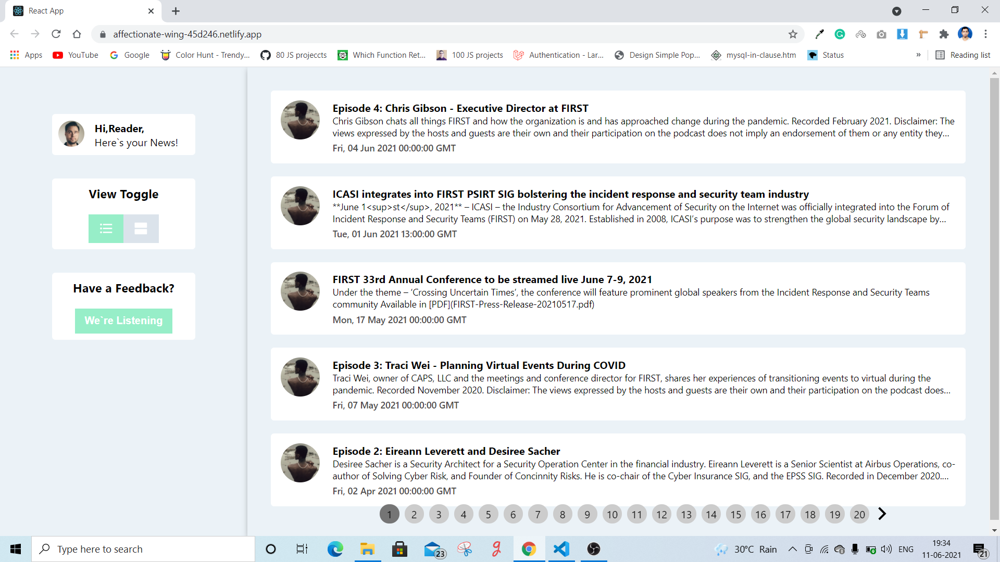
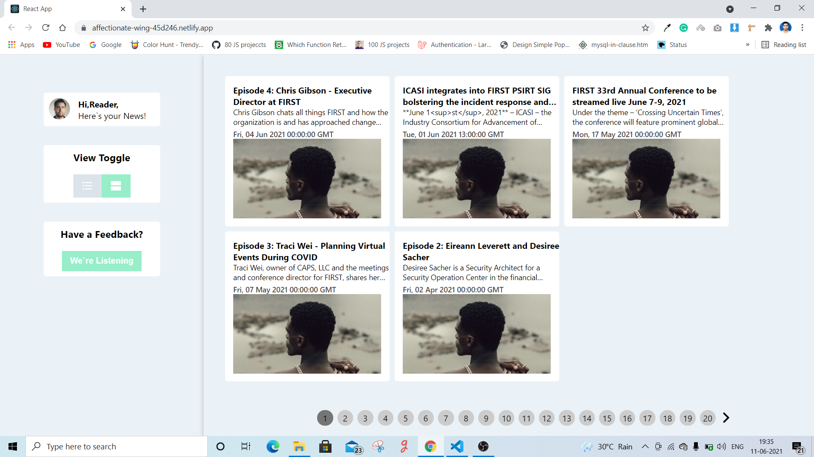
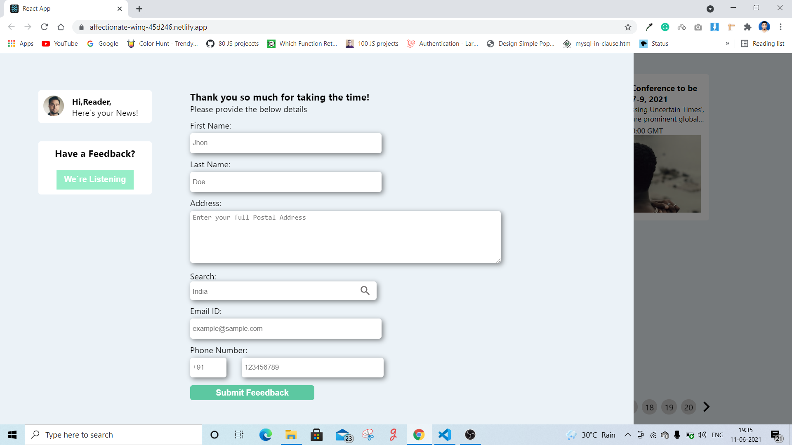

# news-react-redux-app

## Set Up

> STEP:1  Clone this repository by following command

```sh
$ git clone https://github.com/jyotiprakash-m/news-react-redux-app.git
$ cd news-react-redux-app
```
> STEP:2  Then install all the dependencies using below command

```sh
$ npm install 

```
> STEP:3  Now you all set . To run the application use below command

```sh
$ npm start

```
## Screenshots
Some Screenshots of the project





## Live on
I host this application on netlify.com .

> [https://news-react-webapp.netlify.app](https://news-react-webapp.netlify.app)
